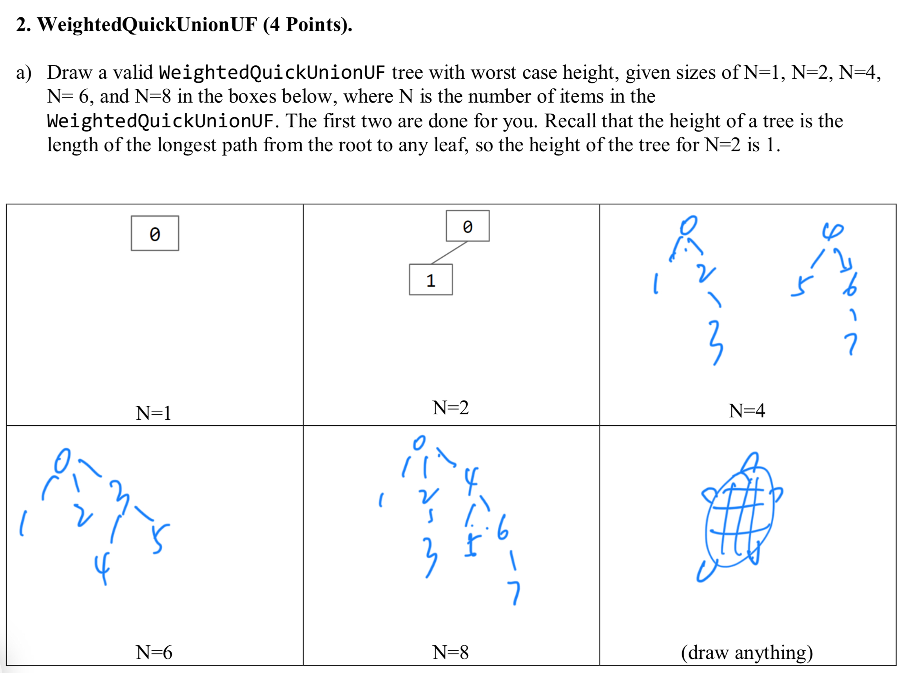
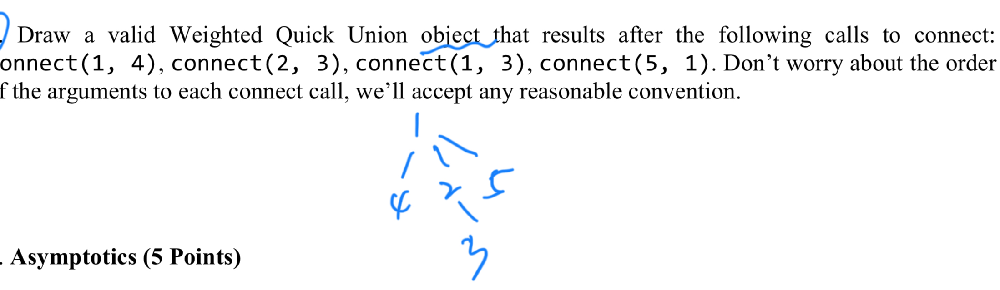
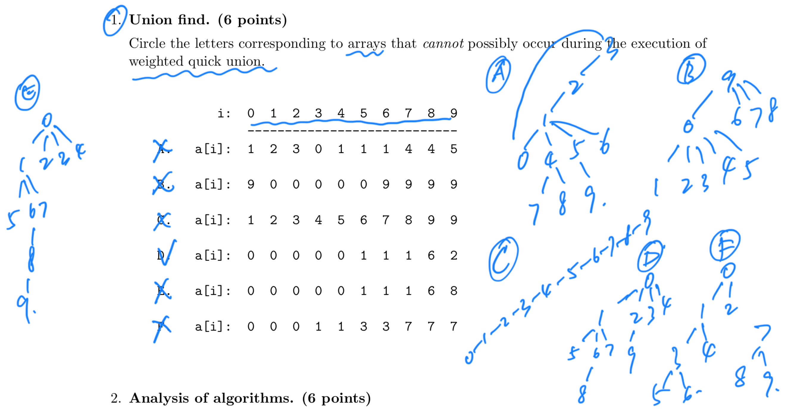
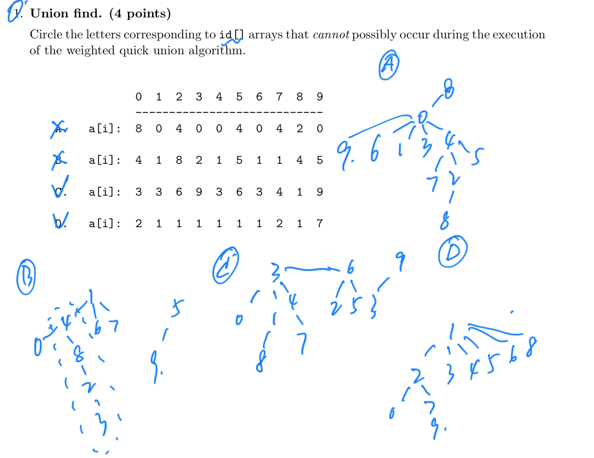
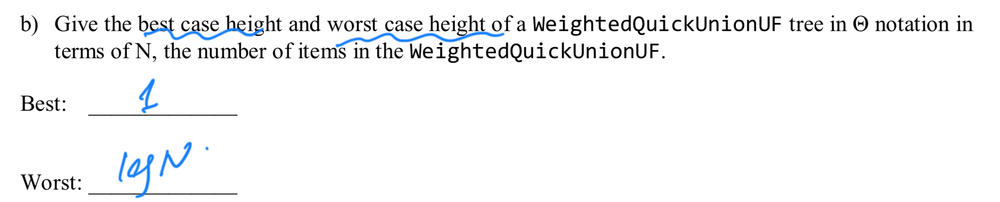
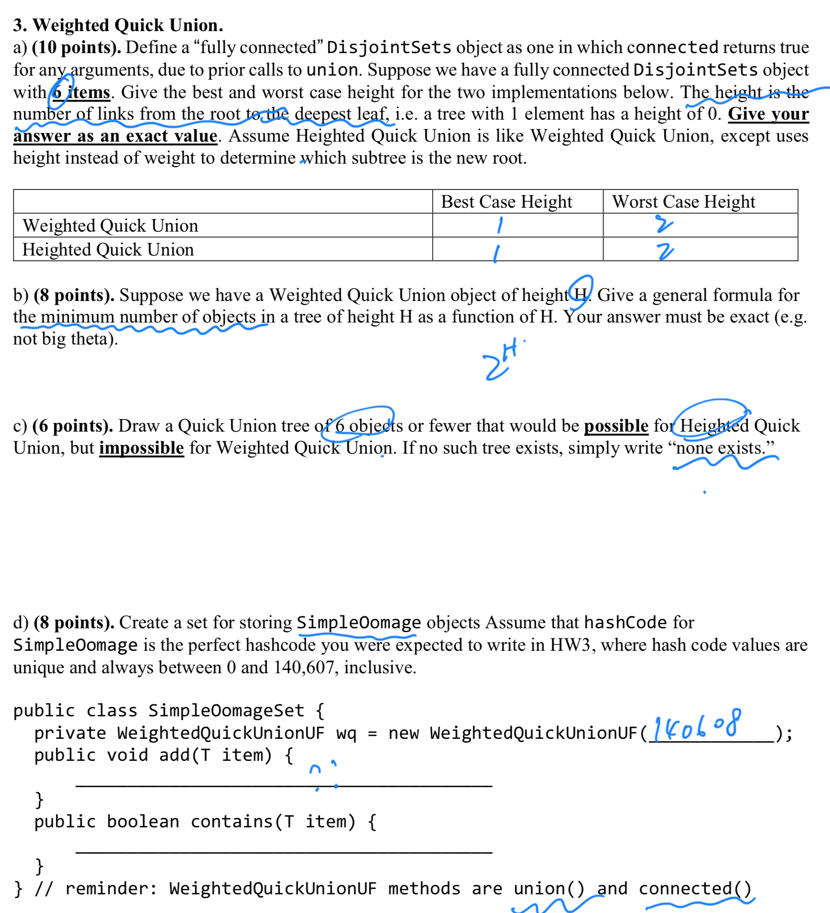

# 13. Disjoint Sets

Author: Josh Hug, Zephyr Omaly

## Cheat Sheet

### Disjoint Sets&#x20;

#### Operations&#x20;

* connect(int p, int q) also called union()&#x20;
* isConnected(int p, int q) also called connected()&#x20;
* find(int p) finds the root of the set p belongs to&#x20;

#### Goal

* Support large number of elements 𝑁 and method calls 𝑀&#x20;

#### Structure:&#x20;

* Store an array of integers. Indicies represent ID, values represent the parent.&#x20;
* **Quick find** (obsolete): Indicies represent ID, values represent set number&#x20;
* **Quick union** connect(p, q): Set the root of p to be q.&#x20;
  * <mark style="color:red;">Parent = − 1 if the element has no parent</mark>&#x20;
* **Weighted quick union connect**(p, q): Connect the smaller branch to the larger branch.&#x20;
  * <mark style="color:red;">Parent = − 𝑘 where k is the number of nodes (including itself)</mark>&#x20;
  * <mark style="color:red;">When calling connect(p, q), modify the parent node sizes appropriately</mark>&#x20;
  * To break ties, connect p to q&#x20;
* **Path compression**: Point each node along the way of find() to the root

| Implementation                          | Runtime        |
| --------------------------------------- | -------------- |
| ListOfSetsDS                            | O(NM)          |
| QuickFindDS                             | Θ(NM)          |
| QuickUnionDS                            | O(NM)          |
| WeightedQuickUnionDS                    | O(N + M log N) |
| WeightedQuickUnionDSWithPathCompression | O(N + M α(N))  |

### Overview [#](broken-reference) <a href="#overview" id="overview"></a>

**Algorthm Development.** Developing a good algorithm is an iterative process. We create a model of the problem, develop an algorithm, and revise the performance of the algorithm until it meets our needs. This lecture serves as an example of this process.

**The Dynamic Connectivity Problem.** The ultimate goal of this lecture was to develop a data type that support the following operations on a fixed number _N_ of objects:

* <mark style="color:red;">`connect(int p, int q)`</mark> <mark style="color:red;"></mark><mark style="color:red;">(called</mark> <mark style="color:red;"></mark><mark style="color:red;">`union`</mark> <mark style="color:red;"></mark><mark style="color:red;">in our optional textbook)</mark>
* <mark style="color:red;">`isConnected(int p, int q)`</mark> <mark style="color:red;"></mark><mark style="color:red;">(called</mark> <mark style="color:red;"></mark><mark style="color:red;">`connected`</mark> <mark style="color:red;"></mark><mark style="color:red;">in our optional textbook)</mark>

We do not care about finding the actual path between `p` and `q`. We care only about their connectedness. A third operation we can support is very closely related to `connected()`:

* <mark style="color:red;">`find(int p)`</mark><mark style="color:red;">: The</mark> <mark style="color:red;"></mark><mark style="color:red;">`find()`</mark> <mark style="color:red;"></mark><mark style="color:red;">method is defined so that</mark> <mark style="color:red;"></mark><mark style="color:red;">`find(p) == find(q)`</mark> <mark style="color:red;"></mark><mark style="color:red;">iff</mark> <mark style="color:red;"></mark><mark style="color:red;">`connected(p, q)`</mark><mark style="color:red;">. We did not use this in class, but it’s in our textbook.</mark>

**Key observation: Connectedness is an equivalence relation.** Saying that two objects are connected is the same as saying they are in an equivalence class. This is just fancy math talk for saying “<mark style="color:red;">every object is in exactly one bucket, and we want to know if two objects are in the same bucket</mark>”. <mark style="color:red;">When you connect two objects, you’re basically just pouring everything from one bucket into another</mark>.

**Quick find.** This is the most natural solution, where each object is given an explicit number. Uses an array `id[]` of length $N$, where `id[i]` is the bucket number of object `i` (which is returned by `find(i)`). To connect two objects `p` and `q`, we set every object in `p`’s bucket to have `q`’s number.

* `connect`: May require many changes to `id`. Takes $\Theta(N)$ time, as algorithm must iterate over the entire array.
* `isConnected` (and `find`): take constant time.

<figure><figcaption></figcaption></figure>

<figure><figcaption></figcaption></figure>

<figure><figcaption></figcaption></figure>

<figure><figcaption></figcaption></figure>

**Quick union.** An alternate approach is to change the meaning of our `id` array. <mark style="color:red;">In this strategy,</mark> <mark style="color:red;"></mark><mark style="color:red;">`id[i]`</mark> <mark style="color:red;"></mark><mark style="color:red;">is the parent object of object</mark> <mark style="color:red;"></mark><mark style="color:red;">`i`</mark>. An object can be its own parent. <mark style="color:red;">The</mark> <mark style="color:red;"></mark><mark style="color:red;">`find()`</mark> <mark style="color:red;"></mark><mark style="color:red;">method climbs the ladder of parents until it reaches the root (an object whose parent is itself)</mark>. To connect `p` and `q`, we set the root of `p` to point to the root of `q`.

* `connect`: Requires only one change to `id[]`, but also requires root finding (worst case $\Theta(N)$ time).
* `isConnected` (and `find`): Requires root finding (worst case $\Theta(N)$ time).

Performing $M$ operations takes $\Theta(NM)$ time in the worst case. Again, this results in quadratic behavior if $M$ is proprtional to $N$.

<figure><figcaption></figcaption></figure>

<figure><figcaption></figcaption></figure>

<figure><figcaption></figcaption></figure>

**Weighted quick union.** <mark style="color:red;">Rather than</mark> <mark style="color:red;"></mark><mark style="color:red;">`connect(p, q)`</mark> <mark style="color:red;"></mark><mark style="color:red;">making the root of</mark> <mark style="color:red;"></mark><mark style="color:red;">`p`</mark> <mark style="color:red;"></mark><mark style="color:red;">point to the root of</mark> <mark style="color:red;"></mark><mark style="color:red;">`q`</mark><mark style="color:red;">, we instead</mark> <mark style="color:red;"></mark><mark style="color:red;">**make the root of the smaller tree point to the root of the larger one**</mark><mark style="color:red;">.</mark> The tree’s _size_ is the _number_ of nodes, not the height of the tree. Results in tree heights of $\lg N$.

* `connect`: Requires only one change to `id`, but also requires root finding (worst case $\lg N$ time).
* `isConnected` (and `find`): Requires root finding (worst case $\lg N$ time).

Warning: if the two trees have the same size, the book code has the opposite convention as quick union and sets the root of the second tree to point to the root of the first tree. This isn’t terribly important (you won’t be tested on trivial details like these).

追踪tree的size有两种方法：

* 第一个是将root的值从-1修改为-size
* 第二个是保存另外一个size数组用来存储节点所在tree的size。

官方是实现用了第二个方法。

<figure><figcaption></figcaption></figure>

<figure><figcaption></figcaption></figure>

<figure><figcaption></figcaption></figure>

**Weighted quick union with path compression.** <mark style="color:red;">When</mark> <mark style="color:red;"></mark><mark style="color:red;">`find`</mark> <mark style="color:red;"></mark><mark style="color:red;">is called, every node along the way is made to point at the root. Results in</mark> <mark style="color:red;"></mark><mark style="color:red;">**nearly flat trees**</mark>. Making $M$ calls to union and find with $N$ objects results in no more than $O(M \log^\*N)$ array accesses, not counting the creation of the arrays. <mark style="color:red;">For any reasonable values of $N$ in this universe that we inhabit, $log^\*(N)$ is at most 5</mark>. It is possible to derive an even tighter bound, mentioned briefly in class (known as the [Ackerman function](https://en.wikipedia.org/wiki/Ackermann\_function)).

#### Summary

<figure><figcaption></figcaption></figure>

<figure><figcaption></figcaption></figure>

### Example Implementations [#](broken-reference) <a href="#example-implementations" id="example-implementations"></a>

You are not responsible for knowing the details of these implementations for exams, but these may help in your understanding of the concepts.

[QuickFind](http://algs4.cs.princeton.edu/15uf/QuickFindUF.java.html)

[QuickUnion](http://algs4.cs.princeton.edu/15uf/QuickUnionUF.java.html)

[WeightedQuickUnion](http://algs4.cs.princeton.edu/15uf/WeightedQuickUnionUF.java.html)

[Weighted Quick Union with Path Compression](http://algs4.cs.princeton.edu/15uf/QuickUnionPathCompressionUF.java.html)

### Exercises [#](broken-reference) <a href="#exercises" id="exercises"></a>

#### Factual [#](broken-reference) <a href="#factual" id="factual"></a>

1. [Problem 2a](https://tbp.berkeley.edu/exams/5286/download/) from Spring 2016 midterm #2.

重点是找worstcase，weightquickunion，最坏的情况是均分然后再组合

<figure><figcaption></figcaption></figure>

1. [Problem 1d](https://tbp.berkeley.edu/exams/5239/download/) from Spring 2015 midterm #1.

<figure><figcaption></figcaption></figure>

1. Check-in exercises, linked [here](https://docs.google.com/forms/d/e/1FAIpQLSc0G3NF2lbX772KHycL-xIb10gKAXdCIwU-9WjXHY5RJLYPHA/viewform?usp=sf\_link)

#### Conceptual [#](broken-reference) <a href="#conceptual" id="conceptual"></a>

1. [Problem 1](http://www.cs.princeton.edu/courses/archive/spring15/cos226/exams/mid-f11.pdf) from the Princeton Fall 2011 midterm.

C：Impossible: tree rooted at 0 has height 9 > lg10.

<mark style="color:red;">weight quick union 原则：（1）数量为N的节点，总高度不能超过lgN；</mark>


<figure><figcaption></figcaption></figure>

1. [Problem 1](http://www.cs.princeton.edu/courses/archive/spring15/cos226/exams/mid-f12.pdf) from the Princeton Fall 2012 midterm.

C. <mark style="color:red;">The size of tree rooted at the parent of 3 is less than twice the size of tree rooted at 3.</mark>&#x20;

<figure><figcaption></figcaption></figure>

#### Procedural [#](broken-reference) <a href="#procedural" id="procedural"></a>

1. [Problem 2b](https://tbp.berkeley.edu/exams/5286/download/) from Spring 2016 midterm #2.

<figure><figcaption></figcaption></figure>

1.  (From Textbook 1.5.8) Does the following implementation of Quick-Find work? If not, give a counter-example:

    ```
     public void connect(int p, int q) {
         if (connected(p, q)) return;

         // Rename p’s component to q’s name.
         for (int i = 0; i &lt; id.length; i++) {
             if (id[i] == id[p]) id[i] = id[q];
         }
         count -= 1;
     }
    ```
2. [Problem 3](https://tbp.berkeley.edu/exams/6137/download/) from Spring 2018 midterm&#x20;

In general, the heights of the two input trees should be the same, but the heavier tree should be attached to the lighter one.

<figure><figcaption></figcaption></figure>

#### Metacognative [#](broken-reference) <a href="#metacognative" id="metacognative"></a>

1. [Problem 3](https://tbp.berkeley.edu/exams/5773/download/) from Spring 2017 midterm #2.
2. For the `WeightedQuickUnionUF` data structure, the runtime of the `union` and `connected` operations is $O(\log N)$. Suppose we create a `WeightedQuickUnionUF` object with N items and then perform $M\_U$ and $M\_C$ union and connected operations, give the runtime in big O notation. Answer (highlight to see): $O(N + (M\_U + M\_C) \log N)$, the N is for array creation, and each operation takes $O(\log N)$ time
3. Same as #2, but give an example of a sequence of operations for which the runtime is $O(N + M\_U + M\_C)$.
4. (From Textbook 1.5.10): In weighted quick-union, suppose that we set `id[find(p)]` to q instead of `id[find(q)]`. Would the resulting algorithm be correct?
5. If we’re concerned about tree height, why don’t we use height for deciding tree size instead of weight? What is the worst-case tree height for weighted-quick-union vs. heighted-quick-union? What is the average tree height?
6. Try writing weighted-quick-union-with-path-compression without looking at the code on the booksite. You may look at the API. Compare your resulting code with [the textbook’s code.](http://algs4.cs.princeton.edu/15uf/WeightedQuickUnionPathCompressionUF.java.html)

* [Overview](broken-reference)
* [Example Implementations](broken-reference)
* [Exercises](broken-reference)
  * [Factual](broken-reference)
  * [Conceptual](broken-reference)
  * [Procedural](broken-reference)
  * [Metacognative](broken-reference)
