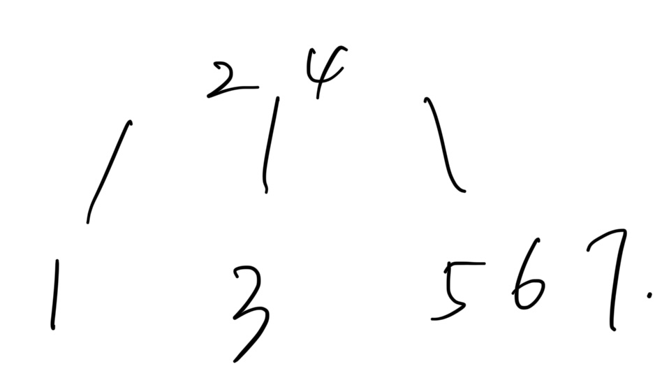
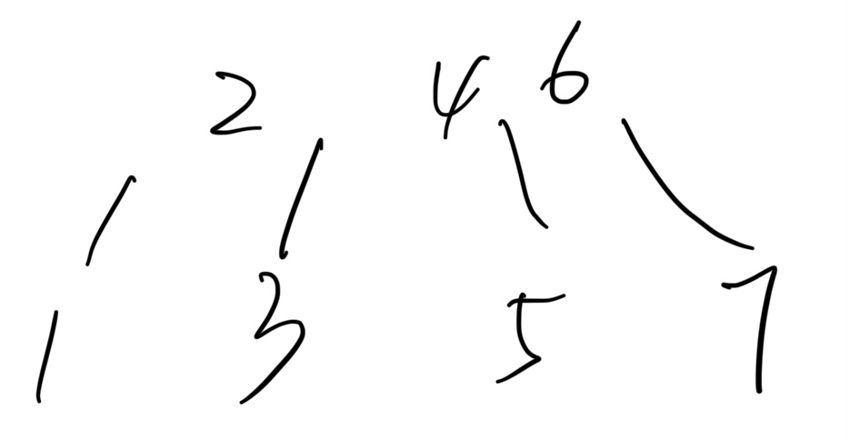

# 17. B-Trees Study Guide

Author: Brandon Lee

### QA [#](broken-reference) 

Linked [here](https://youtu.be/KH49oWy-WjI).

### Check-in Exercise [#](broken-reference) 

Linked [here](https://forms.gle/W2TXgv2RDrF72Tf68).

### BSTs [#](broken-reference) 

**Depth** We define the depth of a _node_ as how far it is from the root. For consistency, we say the root has a depth of 0.

**Height** We define the height of a tree as the depth of the deepest node.

**Average Depth** The “average depth” of a tree is the average depth of a tree’s nodes.

Notice that depending on how we insert into our BST, our height could vary drastically. We say a tree is “**spindly**” <mark style="color:blue;">if it has height close to N</mark> and a tree is “**bushy**” <mark style="color:blue;">if its height is closer to logN</mark>. For operations such as getting a node, we want to have the height to be as small as possible, thus favoring “bushy” BSTs

Two specific B-Trees in this course are <mark style="color:blue;">2-3 Trees (A B-Tree where each node has 2 or 3 children),</mark> and <mark style="color:blue;">2-3-4/2-4 Trees (A B-Tree where each node has 2, 3, or 4 children)</mark>. The key idea of a B-Tree is to over stuff the nodes at the bottom to prevent increaseing the height of the tree. This allows us to ensure a max height of logN.

Make sure you know how to insert into a B-Tree. Refer back to lecture slides for examples. [https://tinyurl.com/balanceYD](https://tinyurl.com/balanceYD)

注意：以2-3 Tree为例：

每个node最多可以stuff进来2个值，可以有2或3个children，也就是说当node塞进来第3个值之后，就需要进行调整：

（1）将middle值上升一层，将smaller和larger的值拆分成branch：如在first中加入5，首先变成second，然后3,4,5的节点拆分，最后得到third。

<figure><figcaption>
first
</figcaption></figure>

<figure><figcaption>
second
</figcaption></figure>

<figure><figcaption>
third
</figcaption></figure>

（2）如果在执行第1条之后，上层节点的数值超过3个，则需要将三个值得middle再向上一层；middle原来的两边的branch分给smaller和larger节点：（在third基础上加6和7）

<figure><figcaption></figcaption></figure>

<figure><figcaption></figcaption></figure>

<figure><figcaption></figcaption></figure>

（3）优先把节点放到子节点中，只有当子节点已经超过限制，必须要再分裂了，才进行分裂。因为分裂可能造成数depth的变大，导致数性能下降？

插入 1,2,3,7,8,9,5的结果是

<figure><figcaption></figcaption></figure>

而不是：

<figure><figcaption></figcaption></figure>

With our restriction on height, we get that the runtime for contains and add are both THETA(LogN)

#### B-Tree invariants [#](broken-reference) 

Because of how we add to our tree, we get two nice invariants for B-Trees:

1. <mark style="color:red;">All leaves must be the same distance from the source. (</mark>**All the leaf nodes must be at the same level**<mark style="color:red;">)</mark>
2. <mark style="color:red;">A non-leaf node with k items mut has exactly k+1 children.</mark>

### Practice Problems [#](broken-reference) 

1. Draw the 2-3 tree that results when you insert the keys A B C D E F G in order.
2. How many compares does it take in the worst case to decide whether to go left, middle, or right from a 3 node?
3. [Problem 5](https://d1b10bmlvqabco.cloudfront.net/attach/hx9h4t96ea8qv/h32s1vxe6mb5o0/i7vkubmrxjn0/fa14\_mt2.pdf) of the Fall 2014 midterm.
4. [Problem 1c, e](https://tbp.berkeley.edu/exams/6137/download/) of the Spring 2018 Midterm 2
5. [Problem 8b](https://tbp.berkeley.edu/exams/5286/download/) of the Spring 2016 Midterm 2

* [QA](broken-reference)
* [Check-in Exercise](broken-reference)
* [BSTs](broken-reference)
* [B-Trees](broken-reference)
  * [B-Tree invariants](broken-reference)
* [Practice Problems](broken-reference)
