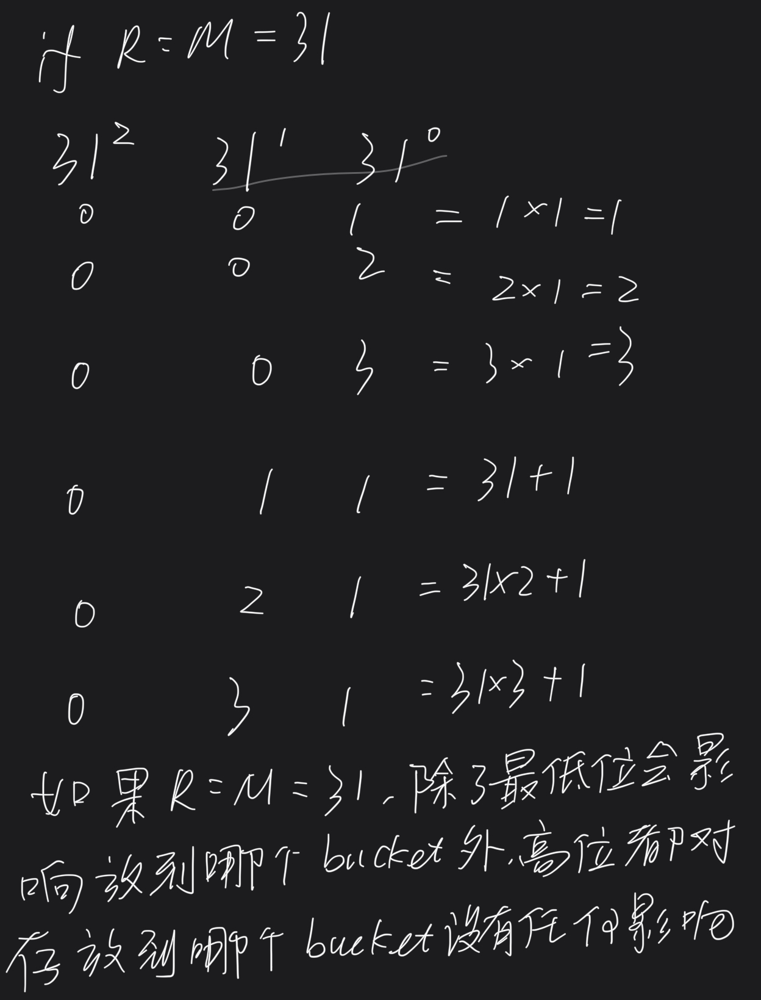

# 19. Hashing Study Guide

Author: Josh Hug

### QA [#](broken-reference) <a href="#qa" id="qa"></a>

Linked [here](https://youtu.be/AJA1Uc\_o5O8).

### Check-in Exercise [#](broken-reference) <a href="#check-in-exercise" id="check-in-exercise"></a>

Linked [here](https://forms.gle/Zt55JNTGxLnRgQsJ6).

### Overview [#](broken-reference) <a href="#overview" id="overview"></a>

**Brute force approach.** All data is just a sequence of bits. Can treat key as a gigantic number and use it as an array index. Requires exponentially large amounts of memory.

**Hashing.** Instead of using the entire key, represent entire key by a smaller value. In Java, we hash objects with <mark style="color:red;">a hashCode() method that returns an integer (32 bit) representation of the object.</mark>

**hashCode() to index conversion.** To use hashCode() results as an index, we must convert the hashCode() to a valid index. Modulus does not work since hashCode may be negative. Taking the absolute value then the modulus also doesn’t work since Math.abs(Integer.MIN\_VALUE) is negative. Typical approach: <mark style="color:red;">use hashCode & 0x7FFFFFFF instead before taking the modulus.</mark>

**Hash function.** Converts a key to a value between 0 and M-1. <mark style="color:red;">**In Java, this means calling hashCode(), setting the sign bit to 0, then taking the modulus.**</mark>

**Designing good hash functions.** Requires a blending of sophisticated mathematics and clever engineering; beyond the scope of this course. Most important guideline is <mark style="color:red;">**to use all the bits in the key**</mark>. If hashCode() is known and easy to invert, adversary can design a sequence of inputs that result in everything being placed in one bin. Or if hashCode() is just plain bad, same thing can happen.

**Uniform hashing assumption.** For our analyses below, <mark style="color:red;">we assumed that our hash function distributes all input data evenly across bins</mark>. This is a strong assumption and never exactly satisfied in practice.

**Collision resolution.** Two philosophies for resolving collisions discussed in class: Separate (a.k.a. external) chaining and ‘open addressing’.

**Separate-chaining hash table.** <mark style="color:red;">Key-value pairs are stored in a linked list of nodes of length M</mark>. Hash function tells us which of these linked lists to use. Get and insert both require potentially scanning through entire list.

**Resizing separate chaining hash tables.** Understand how resizing may lead to objects moving from one linked list to another. <mark style="color:red;">Primary goal is so that M is always proportional to N</mark>, i.e. maintaining a load factor bounded above by some constant.

**Performance of separate-chaining hash tables.** Cost of a given get, insert, or delete is given by number of entries in the linked list that must be examined.

* <mark style="color:red;">The expected amortized search and insert time (assuming items are distributed evenly) is</mark> <mark style="color:red;"></mark><mark style="color:red;">**N / M(N is the total elements in the hash table, M is the buckets number)**</mark><mark style="color:red;">, which is no larger than some constant (due to resizing).</mark>

**Linear-probing hash tables.** We didn’t go over this in detail in 61B, but it’s where you use empty array entries to handle collisions, e.g. linear probing. Not required for exam.

### Recommended Problems [#](broken-reference) <a href="#recommended-problems" id="recommended-problems"></a>

### Example Implementations [#](broken-reference) <a href="#example-implementations" id="example-implementations"></a>

[External Chaining HT](http://algs4.cs.princeton.edu/34hash/SeparateChainingHashST.java.html)

[Linear Probing HT](http://algs4.cs.princeton.edu/34hash/LinearProbingHashST.java.html)

#### C level [#](broken-reference) <a href="#c-level" id="c-level"></a>

1.  \[Adapted from Textbook 3.4.5] Is the following implementation of hashCode() legal?

    ```
     public int hashCode() {
         return 17;
     }
    ```

If so, describe the effect of using it. If not, explain why.

#### B level [#](broken-reference) <a href="#b-level" id="b-level"></a>

1. [Problem 2](https://d1b10bmlvqabco.cloudfront.net/attach/hx9h4t96ea8qv/h32s1vxe6mb5o0/i7vkubmrxjn0/fa14\_mt2.pdf) of the Fall 2014 midterm.

#### A level [#](broken-reference) <a href="#a-level" id="a-level"></a>

1.  One strategy discussed in class for hashing objects containing multiple pieces of data is as follows (in pseudocode), where `x.get(i)` returns the $i$-th piece of data in `x`. See Code 1.

    ```java
    int hashCode = 0;
     for (int i = 0; i < x.length; i += 1) {
        hashCode *= R;
        hashCode += x.get(i).hashCode();
        hashCode = hashCode % M;
     }
     return hashCode;
    ```

    Effectively, we’re summing each piece of data multiplied by a different power of R. In class, we used R = 31, and M is the number of buckets. Explain why the idea above does not work well if M = 31 (or some power of 31).

    EDIT: The problem above is kind of weird. Fix later. (It’s very strange to mod inside of a hashcode function!)

<figure><figcaption></figcaption></figure>

1. If we start with a hash table of size 2 and double when the load factor exceeds some constant. Why is this procedure for setting sizes suboptimal from the perspective of utilizing all of the bits of the hashCode?
2. \[Adapted from textbook 3.4.23] Suppose that we hash strings as described in A-level problem 1, using R = 256 and M = 255. Show that any permutation of letters within a string hashes to the same value. Why is this a bad thing?
3. Find 2 strings in Java that hash to the same value (writing code is probably best).
4. [CS61B Fall 2009 midterm](http://inst.eecs.berkeley.edu/\~cs61b/fa13/samples/test2.pdf), #4 (really beautiful problem)
5.  Explan why the approach in A-level question 1 works better if we initially start the hashCode at 1 instead of 0.

    EDIT: This problem is broken. It’s not better. Thanks SF.

#### A+ level [#](broken-reference) <a href="#a-level-1" id="a-level-1"></a>

1. Give a simple procedure that can be carried out by hand that takes a Java string X and finds another Java string Y with the same hashCode().

* [QA](broken-reference)
* [Check-in Exercise](broken-reference)
* [Overview](broken-reference)
* [Recommended Problems](broken-reference)
* [Example Implementations](broken-reference)
  * [C level](broken-reference)
  * [B level](broken-reference)
  * [A level](broken-reference)
  * [A+ level](broken-reference)
