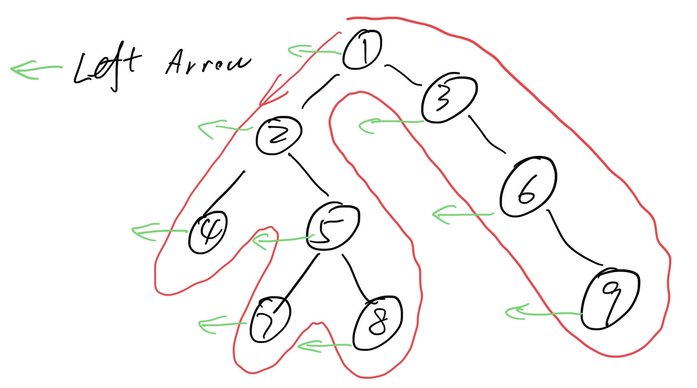
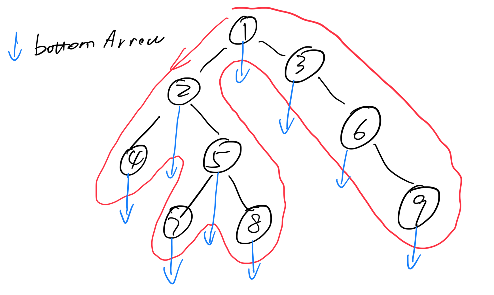
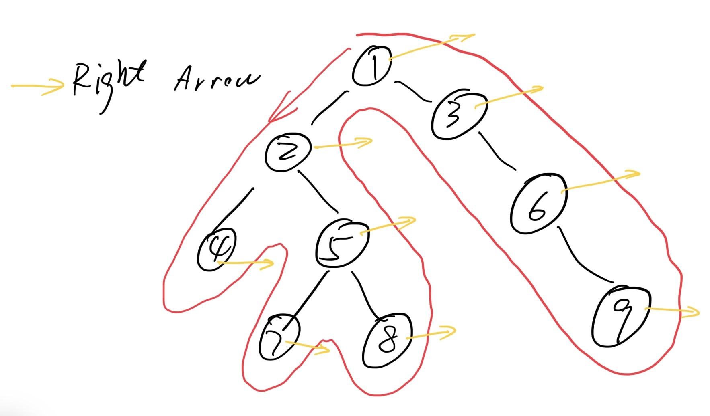

# 21. Trees and Graph Traversals Guide

Author: Josh Hug

### Check-in Exercise [#](broken-reference) <a href="#check-in-exercise" id="check-in-exercise"></a>

Linked [here](https://forms.gle/jyHWEXvWBZc3fnEw6).

### Overview [#](broken-reference) <a href="#overview" id="overview"></a>

**Trees.** <mark style="color:red;">A tree consists of a set of nodes and a set of edges connecting the nodes</mark>, where there **is only one path between any two nodes**. <mark style="color:red;">A tree is thus a graph with no cycles and all vertices connected</mark>.

**Traversals.** When we iterate over a tree, we call this a “<mark style="color:red;">tree traversal</mark>”.

**Level Order Traversal.** A level-order traversal visits every item at level 0, then level 1, then level 2, and so forth.

**Depth First Traversals.** We have three depth first traversals: <mark style="color:red;">Pre-order, in-order and post-order</mark>. In a pre-order traversal, we visit a node, then traverse its children. In an in-order traversal, we traverse the left child, visit a node, then traverse the right child. In a post-order traversal, we traverse both children before visiting. These are very natural to implement recursively. Pre-order and post-order generalize naturally to trees with arbtirary numbers of children. <mark style="color:red;">In-order only makes sense for binary trees.</mark>

```java
preOrder(BSTNode x) {
    if (x == null) return;
    print(x.key)
    preOrder(x.left)
    preOrder(x.right)
}
```

```java
inOrder(BSTNode x) {
    if (x == null) return;
    inOrder(x.left)
    print(x.key)
    inOrder(x.right)
}
```

```java
postOrder(BSTNode x) {
    if (x == null) return;
    postOrder(x.left)
    postOrder(x.right)
    print(x.key)
}
```

**A Useful Visual Trick (for Humans, Not Algorithms)**

* Preorder traversal: We trace a path around the graph, from the top going counter-clockwise. “Visit” every time we <mark style="color:red;">pass the LEFT of a node</mark>. (1, 2, 4, 5, 7, 8, 3, 6, 9，“past the LEFT of a node”，指的是当trace的时候，走过某个node的left (例如“1，2，5”)，或者与某个node 的 null-left-child相切的时候（例如4, 7, 8），就访问这个node)

<figure><figcaption></figcaption></figure>

* Inorder traversal: “Visit” when you cross the bottom of a node.（4,2,7,5,8,1,3,6,9，<mark style="color:red;">bottom是指最底端，可以认为是和底端延伸出的箭头相切就print</mark>）

<figure><figcaption></figcaption></figure>

* Postorder traversal: “Visit” when you cross the right a node.（4,7,8,5,2,9,6,3,1）

<figure><figcaption></figcaption></figure>

打印文件结构的要求：

（1）往下一级，先输出对齐空格；

（2）先打印key（当前目录），然后访问每个子树；

<figure><figcaption></figcaption></figure>

统计目录信息的要求：

（1）先收集每个子树的情况，然后和当前目录的信息结合再返回；

**LLRB insert的时候，调整红黑是放在looper 调用insert子树之前还是之后，直接决定了最后生成的是2-3-4数，还是LLRB**。

<figure><figcaption></figcaption></figure>

**Graphs.** A graph consists of a set of nodes and a set of edges connecting the nodes. However, unlike our tree definition, we can have more than one path between nodes. Note that all trees are graphs. In CS 61B, we can assume all graphs are simple graphs (AKA no loops or parallel edges).

**Graph Terminology**

1. Graph:
   * Set of <mark style="color:red;">vertices</mark>, a.k.a. <mark style="color:red;">nodes</mark>.
   * Set of <mark style="color:red;">edges</mark>: Pairs of vertices.
   * Vertices with an edge between are adjacent.
   * Optional: Vertices or edges <mark style="color:red;">may have labels (or weights)</mark>.
2. A **path** is _<mark style="color:red;">a sequence of vertices connected by edges</mark>._
   * A simple path is a path without repeated vertices.
3. A cycle is a path whose first and last vertices are the same.
   * A graph with a cycle is ‘**cyclic**’.
4. Two vertices are connected if there is a path between them. If all vertices are connected, we say the graph is connected.

<figure><figcaption></figcaption></figure>

Some well known graph problems and their common names:

* **s-t Path**. Is there a path between vertices s and t?
* **Connectivity**. Is the graph connected, i.e. is there a path between all vertices?
* **Biconnectivity**. Is there a vertex whose removal disconnects the graph?
* **Shortest s-t Path**. What is the shortest path between vertices s and t?
* **Cycle Detection**. Does the graph contain any cycles?
* <mark style="color:red;">**Euler Tour**</mark><mark style="color:red;">. Is there a cycle that uses every edge exactly once?</mark>
* <mark style="color:red;">**Hamilton Tour**</mark><mark style="color:red;">. Is there a cycle that uses every vertex exactly once?</mark>
* **Planarity**. Can you draw the graph on paper with no crossing edges?
* **Isomorphism**. Are two graphs isomorphic (the same graph in disguise)?

Often can’t tell how difficult a graph problem is without very deep consideration.

**Depth First Traversals.** DFS for graphs is similar to DFS for trees, but since there are potential cycles within our graph, we add <mark style="color:red;">the constraint that each vertex should be visited at most once</mark>. This can be accomplished by marking nodes as visited and only visiting a node if it had not been marked as visited already.&#x20;

This idea of <mark style="color:red;">exploring a neighbor’s entire subgraph before moving on to the next neighbor</mark> is known as Depth First Traversal.

1. marked用来保证vertex只被访问一次；
2. edgeTo用来记录到达每个节点的前置节点，edgeTo\[w] = v，表示v is edge to w，要到达w，可以先到达v，<mark style="color:red;">具体的作用是啥？</mark>
3. <mark style="background-color:red;">现在都是成员都是数字，所以marked和edgeTo可以直接用一个int array来表示，如果是set、tree或者map呢？</mark>

<figure><figcaption></figcaption></figure>


What we just did in <mark style="color:red;">DepthFirstPaths is called “</mark><mark style="color:red;">**DFS Preorder.**</mark><mark style="color:red;">”</mark>

1. DFS Preorder: <mark style="color:red;">Action is before DFS calls to neighbors</mark>.
   * Our action was setting <mark style="color:red;">edgeTo</mark>.
   * Example: edgeTo\[1] was set before DFS calls to neighbors 2 and 4.
2. One valid DFS preorder for this graph: 012543678
   * Equivalent to the order of dfs calls.

<figure><figcaption></figcaption></figure>

Could also do actions in <mark style="color:red;">**DFS Postorder**</mark><mark style="color:red;">.</mark>

1. <mark style="color:red;">DFS Postorder: Action is after DFS calls to neighbors</mark>.
2. Example: dfs(s):
   * mark(s)
   * For each unmarked neighbor n of s, dfs(n)
   * print(s)
3. Results for dfs(0) would be: 347685210
4. Equivalent to the order of dfs returns.

**实际操作过程中，可以想象将print函数放在不同位置，来确定pre order，in order和post order的输出。**

### Recommended Problems [#](broken-reference) <a href="#recommended-problems" id="recommended-problems"></a>

#### C level [#](broken-reference) <a href="#c-level" id="c-level"></a>

1. [Question 1](http://inst.eecs.berkeley.edu/\~cs61b/fa14/ta-materials/discussion7.pdf) from the Fall 2014 discussion worksheet.

#### B level [#](broken-reference) <a href="#b-level" id="b-level"></a>

1. [Question 4](https://d1b10bmlvqabco.cloudfront.net/attach/hx9h4t96ea8qv/h32s1vxe6mb5o0/i7vkubmrxjn0/fa14\_mt2.pdf) from the Fall 2014 midterm.

#### A level [#](broken-reference) <a href="#a-level" id="a-level"></a>

1. [Question 7](http://datastructur.es/sp15/materials/guerrilla/guerrilla2.pdf) from the guerrilla section worksheet #2 from Spring 2015.

* [Check-in Exercise](broken-reference)
* [Overview](broken-reference)
* [Recommended Problems](broken-reference)
  * [C level](broken-reference)
  * [B level](broken-reference)
  * [A level](broken-reference)
