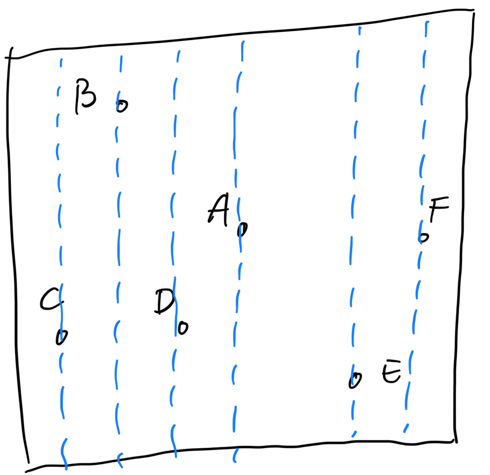

# Introduction to K-D Trees

Terminology：

Hypersphere

Hyperplane

In computer science and computational geometry, K-D Trees have become a popular data structure used to <mark style="color:red;">organize points in K-dimensional space</mark>, where K is usually a very big number. **This is because these structures allow for very efficient searches of points in multidimensional space, including nearest-neighbor searches and range searches.**

In this tutorial, we’ll explore how K-D trees are created and how they are used. We’ll also examine the advantages of using them as well as their practical applications.

### 2. What Are K-D Trees? 

A K-D Tree is a binary tree in which each node represents a k-dimensional point**. Every non-leaf node in the tree acts as a hyperplane, dividing the space into two partitions.** <mark style="color:red;">This hyperplane is perpendicular to the chosen axis, which is associated with one of the K dimensions</mark>.

**There are different strategies for choosing an axis when dividing, but the most common one would be **<mark style="color:red;">**to cycle through each of the K dimensions repeatedly and**</mark> <mark style="color:red;">**select a midpoint along it**</mark>** to divide the space.** For instance, in the case of 2-dimensional points with x and y axes, we first split along the x-axis, then the y-axis, and then the x-axis again, continuing in this manner until all points are accounted for:

从这里看是，选择axis的原则是loop though所有维度，选择一个能等分的维度（midpoint）。

（1）为什么要选择midpoint？

假设所有点是随机的，因为是midpoint，接下来subplane里面的点数分布应该是最可能平均的，也就是说左右子树尽量相当，树尽可能bushy，最接近平衡BST。

（2）有没有可能一直是同一个axis？

从逻辑上是有可能的，可能出现一直是同一个轴作切分平面，如下图。如果是按照这个逻辑，F应该是用y轴作区分，而不是x轴。但是这个可能是为了算法简单吧。

<figure><figcaption></figcaption></figure>

<figure><figcaption></figcaption></figure>

### 3. How to Build a K-D Tree? 

The construction of a K-D Tree involves recursively partitioning the points in the space, forming a binary tree. The process starts by selecting an axis. <mark style="color:red;">We then choose the middle(median) point along the axis and split the space, so that the remaining points lie into two subsets based on their position relative to the splitting hyperplane.</mark>

The left child of the root node is then created with the points in the subset that lie to the left of the hyperplane, while the right child is created with the points that lie to the right. This process is repeated recursively for each child node, selecting a new axis and splitting the points based on their position relative to the new hyperplane.

<figure><figcaption></figcaption></figure>

If the above algorithm is executed correctly, <mark style="color:red;">the resulting tree will be balanced</mark>, with each leaf node being approximately equidistant from the root. <mark style="color:red;">**To achieve this, it’s essential to select the median point every time**</mark>. It is also worth noting that finding the median can add some complexity, as it requires the usage of another algorithm. <mark style="color:red;">If the median point is not selected, there is no guarantee that the tree will be balanced.</mark>

One approach to finding the median is to use a sorting algorithm, sort the points along the selected axis and take the middle point. To address the added complexity, <mark style="color:red;">we can sort a fixed number of randomly selected points and use the median of those points as the splitting plane</mark>. This alternative practice can be less computationally expensive than sorting the entire array of points.

### 4. Inserting and Removing Nodes 

Inserting and removing nodes are essential operations in maintaining a K-D tree’s structure and performance. However, due to the tree’s special characteristics, they must be implemented with care. That is why in this section, we’ll discuss both operations in detail.

#### 4.1. Insertion 

To add a new point to a K-D tree, we can follow the same process as when adding an element to any other search tree. Start by traversing the tree from the root and move to either the left or right child depending on the location of the point being inserted in relation to the splitting plane. Once we reach the node under which the child should be located, add the new point as either the left or right child of the leaf node, depending on which side of the node’s splitting plane contains the new node.

However, this method of adding points can cause the tree to become unbalanced, reducing its performance. The degree of degradation in the tree’s performance <mark style="color:red;">depends on the spatial distribution of the points being added and the number of points added to the tree’s size.</mark> If the tree becomes too unbalanced, <mark style="color:red;">it may be necessary to re-balance the tree to restore its performance for queries that rely on tree balancing,</mark> such as nearest neighbor searching.

#### 4.2. Deletion 

When deleting a node from a K-D tree, we first need to locate the node to be deleted, just like deleting from a Binary Search Tree. If the node has no children, it can be removed from the tree without affecting its structure. <mark style="color:red;">If the node has a descendant, we need to find the right descendant of the node that can replace it without violating the K-D tree property.</mark>

In a Binary Search Tree, we replace the node to be deleted with its existing child if one of the children is not present. However, in a K-D tree, replacing the node with its child would break the K-D tree property <mark style="color:red;">since the child’s dimension would be different from the node’s axis.</mark> For instance, if a node divides by x-axis values, then its children divide by the y-axis. Hence, we can’t just replace the node with its child.

To find a suitable replacement, we consider the following scenarios:

1. If the node to be deleted has children to the right, we must find <mark style="color:red;">the node with the minimum value along the targeted axis</mark> from the right subtree.
2. Otherwise, we need to find <mark style="color:red;">the point with the maximum value from the subtree</mark> rooted at the left child.

Once we’ve found the replacement node, we use it to replace the node to be deleted and then delete it recursively from the subtree it was selected from.

"the targeted axis"，指的是被删除节点的轴，也就是说：假设要被删除的节点是x-axis：

1，如果有右子树，就在右子树中找到x-axis方向最小节点，替换节点，然后recursively调用delete函数删除这个节点；

2，否则，就在左子树中找到x-axis方向最大的节点，替换节点，然后recursively调用delete函数删除这个节点；

### 5. Nearest Neighbour Search 

K-D trees are widely used for nearest-neighbor searches, where the objective is <mark style="color:red;">to find the point in the tree that is closest to a given query point</mark>.

To accomplish this, we traverse the tree and <mark style="color:red;">compare the distance between the query point and the points in each leaf node.</mark> Starting at the root node, we recursively move down the tree until we reach a leaf node, following a similar process as when inserting a node. At each level, <mark style="color:red;">we decide whether to go down the left or right subtree based on which side of the splitting hyperplane the query point lies</mark>.

Once we reach a leaf node, we compute the distance between the query point and that leaf node, and <mark style="color:red;">save it as the “current best”.</mark> **During each unwinding of the recursion, we keep track of the distance and update the current best.** <mark style="background-color:red;">Additionally, at each step, we check whether there could be a point on the other side of the splitting plane that is closer to the search point than the current best.</mark>

**Conceptually, we are checking if a hypersphere around the query point with a radius equal to the current nearest distance intersects the splitting hyperplane of the node.**

Since the hyperplanes are all axis-aligned this is implemented as a simple comparison to see whether the absolute distance  between the splitting coordinate of the search point and the current node is lesser than the overall distance  from the search point to the current best.

**If the hypersphere intersects the plane, there may be nearer points on the other side of the plane**. Therefore, we move down the other branch of the tree from the current node, looking for closer points and following the same recursive process as the entire search.

If t[<mark style="color:red;">he hypersphere doesn’t intersect the splitting plane</mark>](#user-content-fn-1)[^1], we continue unwinding and walking up the tree and eliminate the entire branch on the other side of that node. After we finish this process for the root node, the search is complete.

One thing to note is that the distance metric in our example is the classical euclidian distance defined as:

&#x20;   .png>)

<mark style="color:red;">The search procedure can certainly be generalized to other distance metrics, however, the “hypersphere” which we test for intersection with the hyperplane will be replaced with the equivalent geometrical object for the given metric.</mark>

In the next illustration, we are querying the black crossed dot’s nearest neighbor in the tree. We have already traversed down the tree and reached the leaf node  and saved it as the current best. So, we are unwinding and comparing the Euclidian distance from it to the query point with the absolute distance from it to the next current node :

<figure><figcaption></figcaption></figure>

Here the Euclidian distance is bigger, meaning the hypersphere intersects the cutting plane of  and therefore we switch to traversing the  branch.

如果找到了更小的节点，那么以target为圆心、currentbest为半径的hypersphere肯定是要更新的，<mark style="color:red;">但是如何判断和hypersphere是否相切呢？</mark>

**上面的例子可以看到，最开始的距离最小的是target-C，但是实际的结果为target-F。**

### 6. Complexity 

The time complexity of building a K-D tree from a set of n points in k-dimensional space **depends on the median finding algorithm** used.

If a more efficient median-of-medians algorithm is used the total complexity is O(nlog(n)), on average. This is because, at each level of the tree, <mark style="color:red;">a new hyperplane is chosen to split the set of points</mark>, which takes  O(n) time. Since the tree is binary, the number of levels in the tree is log(n). Therefore, the total time complexity of building the _K_-D tree is O(nlog(n)). However, in the worst case, the construction time can be  O(n^2), which can occur if the tree is very unbalanced.

If instead, a classical sort algorithm with O(nlog(n)) complexity is used to find the median, the total complexity becomes O(nlog^2(n)).

#### 6.1. Nearest Neighbour Search 

The time complexity of the nearest neighbor search in a K-D tree is  on average, where n is the number of points in the tree. This is because the search process involves traversing the tree in a binary search-like manner, where the number of nodes visited is proportional to the height of the tree, which is O(log(n)) on average.

However, in the worst case, the time complexity of the nearest neighbor search in a K-D tree can be O(n), where  is the number of points in the tree. This can happen if the tree is highly unbalanced, and the search path goes through all the nodes in the tree.

<figure><figcaption></figcaption></figure>

### 7. Applications 

K-D trees have a wide range of applications. As already mentioned, one of the most common uses is nearest neighbor search, where they’re used to find the closest point to a given point quickly. This **makes them a useful component of many machine learning approaches like k-nearest neighbors(**<mark style="color:red;">**KNN**</mark>**)** and a wide range of distance-based clustering algorithms.

Another application of K-D trees is range search, where they’re used to find all points within a given distance of a query point. This is useful in spatial data analysis, geographic information systems (GIS), and other applications that require identifying points within a specific range.

### 8. Advantages and Disadvantages 

One of the primary advantages of K-D trees is that they allow for efficient k-nearest neighbor (KNN) queries, which are useful in applications such as <mark style="color:red;">image recognition and recommendation systems</mark>. They can also be used for range queries, which allow for fast searches of points within a given radius or bounding box.

However, there are also several disadvantages to using K-D trees. One of the most significant limitations is that they can become inefficient in higher dimensions, due to a phenomenon called the “<mark style="color:red;">curse of dimensionality.</mark>” This occurs because as the number of dimensions increases, the volume of the space between points increases exponentially, making it difficult to capture the geometric relationships between points accurately.

Additionally, the performance of K-D trees can be highly sensitive to the choice of splitting axis and point selection strategy, which can impact the overall efficiency of the search algorithm. Finally, K-D trees may not perform well when the data is highly skewed or has a complex distribution, in which case other types of data structures, such as ball trees or cover trees, may be more effective.

### 9. Conclusion 

In this article, we explored K-D trees and their inner workings. We examined how they are created, including how to build, insert, and remove nodes. We also discussed the advantages and practical applications of using them in multidimensional space for efficient nearest-neighbor and range searches. By utilizing the algorithms and techniques presented here, we can see how K-D trees can greatly enhance performance and make complex searches more efficient.

[^1]: hwo
