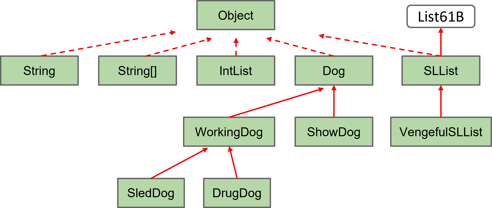
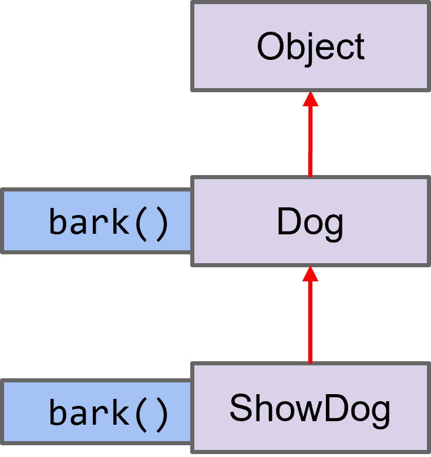

# 9. Inheritance 2 Lecture Guide

Author: Kartik Kapur, Brandon Lee, Zephyr Omaly

### Lecture Code  <a href="#lecture-code" id="lecture-code"></a>

Code from this lecture available at

[https://github.com/Berkeley-CS61B/lectureCode-fa22/tree/main/lec9\_inheritance2](https://github.com/Berkeley-CS61B/lectureCode-fa22/tree/main/lec9\_inheritance2).

### Overview  <a href="#overview" id="overview"></a>

**The Interface and implements.** The idea of inheritance is for a class to use properties of a parent class. Inheritence of a parent class and interfaces are different (<mark style="color:orange;">Note that a class can do both, even at the same time</mark>)&#x20;

1. The syntax for implemeting an interface:

```java
SLList<Blorp> implements List61B<Blorp>{...}
```

2. The syntax to extend the qualities of another class:

```java
Class_Name<Item> extends Class_Name<Item>{...}
```

Note that we are extending a class, not an interface.

**Usage of Inheritance.** Say `RotatingSLList` should be able to do everyhthing that SLList can; however, it should also be able to rotate to the right. Doing the following will allow for RotatingSLList to have all the qualities of SLList as well as its own method `rotateRight`.

```java
public class RotatingSLList<Blorp> extends SLList<Blorp>{
  public void rotateRight() {...}
}
```

**What is Inherited?** For now, we will say that we can inherit:

* <mark style="background-color:green;">Instance and static variables.</mark>
* <mark style="background-color:green;">All methods.</mark>
* <mark style="background-color:green;">All nested classes.</mark>&#x20;

But <mark style="color:red;">members may be private and thus inaccessible, and constructors are not inherited</mark>.

**The Special Case of the Constructor?** Even though constructor’s are not inherited, we still use them. We can call the constructor explicitly by using the keyword **`super()`**. At the start of every constructor, there is already an implicit call to its super class\`s constructor. As a result

```java
public VengefulSLList() {
  deletedItems = new SLList<Item>();
}
```

is equivalent to

```java
public VengefulSLList() {
  super();
  deletedItems = new SLList<Item>();
}
```

However, <mark style="color:purple;">constructor\`s with arguments are not implicitly called</mark>. This means that.

```java
public VengefulSLList() {
    super(x);
    deletedItems = new SLList<Item>();
  }
```

is not equivalent to

```java
public VengefulSLList() {
    deletedItems = new SLList<Item>();
  }
```

<mark style="color:red;">This is because only the empty argument</mark> <mark style="color:red;"></mark><mark style="color:red;">`super()`</mark> <mark style="color:red;"></mark><mark style="color:red;">is called.</mark>

**Is A.** When a class inherits from another, we know that it must have all the qualities of it. This means that `VengefulSLList` is a `SLList` because it has all the qualities of an `SLList`- it just has a few additional ones too.

Every single class <mark style="color:purple;">is a descendent on the Object class</mark>, meaning they are all Objects. Actually, every type in Java is a decendent of the Object class.

<figure><figcaption><p>Object Inheritance in Java</p></figcaption></figure>

**Encapsulation** When building large programs, our enemy is complexity. Some tools for managing complexity:

1. Hierarchical abstraction.&#x20;
   * Create layers of abstraction, with clear abstraction barriers
2. “Design for change” (D. Parnas)
   * [Organize program around objects.](#user-content-fn-1)[^1]
   * Let objects decide how things are done.
   * Hide information others don’t need.

**Static vs. Dynamic Type Reminder**&#x20;

* **Static Type** The type specified <mark style="color:red;">when the variable is declared</mark>, and is <mark style="color:orange;">checked at compile time</mark>.&#x20;
* **Dynamic Type** The type is specified <mark style="color:red;">when the variable is instantiated</mark>, and <mark style="color:orange;">is checked at runtime.</mark>

**Casting** In Java, every object has <mark style="color:purple;">a static type (defined at compile-time) and a dynamic type (defined at run-time)</mark>. Our code may rely on the fact that some variable may be a more specific type than the static type. For example if we had the below definitions:

```java
Poodle frank  = new Poodle("Frank", 5);
Poodle frankJr = new Poodle("Frank Jr.", 15);
```

This statement would be valid

```java
Dog largerDog = maxDog(frank, frankJr);
```

But this one would not be

```java
Poodle largerPoodle = maxDog(frank, frankJr);
```

Poodle是Dog，但是Dog不一定是Poodle，所以可以是Dog = Poodle，但是Poodle = Dog的话要加强制转换，而且即使强制转换compile通过了，在运行的时候也有可能出错。

The reason the former statement is valid is because the compilers knows for a fact that anything that is returned from a `maxDog` function call is a `Dog`. However, in the latter case, the compiler does not know for a fact that the return value of `maxDog` would result in a `Poodle` even though both `Dog` arguments are `Poodle`s.

Instead of being happy with just having a generic `Dog`, we can be a bit risky and use a technique called casting. Casting allows us to force the static type of a variable, basically tricking the compiler into letting us force the static type of am expression. To make `largerPoodle` into a static type `Poodle` we will use the following:

```java
Poodle largerPoodle = (Poodle) maxDog(frank, frankJr);
```

Note that we are not changing the actual dynamic type of maxDog- we are just telling the compiler what is coming out of maxDog will be a `Poodle`. This means that any reference to `largerPoodle` will have a static type of `Poodle` associated with it.

<mark style="color:red;">Casting, while powerful is also quite dangerous</mark>. You need to ensure that what you are casting to can and will actually happen. There are a few rules that can be used:

* You <mark style="color:orange;">can always cast up (to a more generic version of a class)</mark> without fear of ruining anything because we know the more specific version is a version of the generic class. For example you can always cast a Poodle to a Dog because all Poodles are Dog’s.
* You <mark style="color:orange;">can also cast down (to a more specific version of a class)</mark> <mark style="color:green;">with caution</mark> as you need to make sure that, during runtime, nothing is passed in that violates your cast. For example, sometimes Dog’s are Poodle’s but not always.（也就是说，如果在Runtime cast down的事后，dynamic type不是Poodle对象 cast成Poodle，就会出发Exception，即使只是Dog）
* Finally, <mark style="color:orange;">you cannot</mark> <mark style="color:red;">ever</mark> <mark style="color:orange;">cast to a class that is neither above or below the class being cast</mark>. For an example, you cannot cast a Dog to a Monkey because a Monkey is not in the direct lineage of a Dog - it is a child of Animal so a bit more distant. You can think of this as “side casting” and it will result in a compile time error since the compiler knows this cast cannot possibly work.

下面的例子是Casting出错的情况，虽然可以tricking compiler，但是实际运行的时候会丢出来<mark style="color:purple;">ClassCastException</mark>，因为得到的结果是返回Malamut。(Dog是interface，Poodle和Malamute分别implemented这个interface，maxDog的两个输入参数是Dog类型，用来比较不同品种的狗的大小)

```java
Poodle frank = new Poodle("Frank", 5);
Malamute frankSr = new Malamute("Frank Sr.", 100);

Poodle largerPoodle = (Poodle) maxDog(frank, frankSr);
```

实际操作过程中的逻辑：或者应该理解成，在判断Runtime的运行机制的时候：（1）variables直接根据dynamic type判断实际的对象类型；（2）<mark style="color:red;">但是对method进行dynamic type判定的时候，输入变量类型不是看input variable的dynamic type，而是基于它的static type</mark>。

Consider the Java Code

```java
// Some code
foo.call(bar)
```

**Compile Time**

1. Look in the static class of foo and find the method with the <mark style="color:red;">exact same signature</mark> as call

（1）“<mark style="color:red;">Exact same</mark>” = a method named call that takes the same number of arguments (in this case 1) whose type(s) complements the static type(s) of the passed in variable(s)&#x20;

（2）Ex. if we can’t find call(static type of bar), call(parent class of static type of bar) works too. 在当前类和所有父类中都找不到exact same，接下来才是将parent作为输入也可以

2. If you can’t find it, look in the parent class of the static class of foo, and keep going up the tree of inheritance
3. If we find a match, “lock” it in. Otherwise, compile time error

**Runtime**

1. Go to the dynamic type of foo
2. <mark style="color:red;">Run the method with the exact same signature “locked” in at compile time（动态的时候，也是优先调用在Compile Time locked住的函数）</mark>
3. If you can’t find a method with the exact same signature, go up the inheritance tree of the dynamic type of foo
4. If no match is found, run the locked-in method

**Casting Effectiveness** <mark style="color:red;">Casting does not have any lasting effect, it is only takes effect while compiling, it just tempararily works for compiler to check;</mark> During runing time, the actual funciton called is depend on the dynamic type.

可以用图确定指针指的具体的Object对象是谁，Object对象就是runtime environment时候真实的执行载体。

<div data-full-width="false">

<figure><figcaption></figcaption></figure>

</div>

<pre class="language-java" data-line-numbers><code class="lang-java"><strong>Object o2 = new ShowDog("Mortimer", "Corgi", 25, 512.2);
</strong><strong>ShowDog sdx = ((ShowDog) o2);
</strong>sdx.bark();
Dog dx = ((Dog) o2);
<strong>dx.bark();
</strong>((Dog) o2).bark();
Object o3 = (Dog) o2;
o3.bark();
</code></pre>

1. In Line5 and Line6, ShowDog's bark() will be called, because dynamic type is ShowDog.
2. Line7 will compile pass, because Dog is an Object;
3. Line8 will fail, because static type of o3 is Object, and Object does not have a bark() method;

**为什么Dynamic Type是ShowDog？**

从内存的角度是OK的，因为最开始定义的o2实际指向的就是ShowDog的bark方法，虽然做了casting，但是对应的函数指针还是指向ShowDog的bark()。使用函数调用关系图可以比较明确。

<mark style="color:green;">DynamicType就是实际运行的时候，对象在内存中对应实体（占用内存空间）</mark>。不管如何做Casting，内存实体还是同一个，所以<mark style="color:green;">在最开始定义的时候，new后面的内容就是DynamicType，在最开始定义做instantiate的时候就定了，例如new ShowDog()，DynamicType就是ShowDog，不管后面再如何做Casting，类型还是ShowDog。</mark>

而StaticType是Casting给编译器看的。

**Dynamic Method Selection** <mark style="color:purple;">The rule is, if we have a static type</mark> <mark style="color:purple;"></mark><mark style="color:purple;">`X`</mark><mark style="color:purple;">, and a dynamic type</mark> <mark style="color:purple;"></mark><mark style="color:purple;">`Y`</mark><mark style="color:purple;">, then if</mark> <mark style="color:purple;"></mark><mark style="color:purple;">`Y`</mark> <mark style="color:purple;"></mark><mark style="color:purple;">overrides the method from</mark> <mark style="color:purple;"></mark><mark style="color:purple;">`X`</mark><mark style="color:purple;">, then on runtime, we use the method in</mark> <mark style="color:purple;"></mark><mark style="color:purple;">`Y`</mark> <mark style="color:purple;"></mark><mark style="color:purple;">instead</mark>. Student often confuse overloading and overriding.

以Dog和Poodle的例子为例，如果如果定义了一个Dog dx = new Poodle()，dx的static type是Dog，dynamic type是Poodle。如果dx调用了bark()函数，首先会使用Poodle中的bark()。

[**Overloading and Dynamic Method Selection** ](#user-content-fn-2)[^2]Dynamic method selection plays no role when it comes to overloaded methods. Consider the following piece of code, where `Fox extends Animal`.


```java
Fox f = new Fox();
Animal a = f;
define(f);
define(a);
```


Let’s assume we have the following overloaded methods in the same class:

```java
public static void define(Fox f) { ... }
public static void define(Animal a) { ... }
```

Line 3 will execute `define(Fox f)`, while line 4 will execute `define(Animal a)`. <mark style="color:purple;">Dynamic method selection only applies when we have overridden methods.</mark> There is no overriding here, and therefore dynamic method selection does not apply.

**High Order Funcitons** As old school style in Java 7, memory boxes (variables) cannot contain pointer to functions. Can use an interface instead. Take `y = f(f(x))` for example:

```java
public interface IntUnaryFunction {
  int apply(int x);
}

public class TenX implements IntUnaryFunction {
  public int apply(int x) {
     return 10 * x;
  }
}

public class HoFDemo {

	public static int do_twice(IntUnaryFunction f, int x) {
   		return f.apply(f.apply(x));
	}
	
	public static void main(String[] args) {
   		System.out.println(do_twice(new TenX(), 2));
	}
}
```

1，为什么do\_twice使用了static关键字：为了在调用的时候不做实例化；

2，为什么需要定义一个interface：因为java7是不支持函数作为输入的，因为function是无类型的；<mark style="color:red;">为了将函数作为输入变量，需要将添加一个interface作为媒介，并且定义相应的class实现这个interface</mark>。对应的Python代码如下：

```python
define tenX(x):
    return 10 * x
define do_twice(f, x):
    return f(f(x))
print(do_twice(tenX, 2))
```

### Exercises <a href="#exercises" id="exercises"></a>

#### Factual <a href="#factual" id="factual"></a>

1. Do the problems from [lecture](https://docs.google.com/presentation/d/15Ac0Xrd1sVA5\_YSqPe6HdvD7DIhX2t4R6O-eQ3W6VBQ/edit#slide=id.g4f54a83fc15915b9538)
2. Check-in exercises, linked [here](https://docs.google.com/forms/d/e/1FAIpQLScpBR\_9qnT2TUGR5MbPSpMfvhlVC-WJxlyRG0T-bUDsHv-svg/viewform?usp=sf\_link)

#### Conceptual <a href="#conceptual" id="conceptual"></a>

1. Is it possible for an interface to extend a class? Provide an argument as to why or why not.
2. What are the differences between inheritance through classes and interfaces? Is there a particular time when you would want to use one over the other?

#### Procedural <a href="#procedural" id="procedural"></a>

1.  Say there is a class `Poodle` that inherits from `Dog`. The Dog class looks like this

    ```java
     public class Dog{
         int weight;
         public Dog(int weight_in_pounds) {
           weight = weight_in_pounds;
         }
       }
    ```

    And the Poodle class looks like this.

    ```java
     public class Poodle extends Dog{
       public Poodle() {}
     }
    ```

    Is this valid? If so explain why Poodle is a Dog if Dog has no constructor with no argument. If it is not valid then explain how we can make it valid.\


    <mark style="background-color:blue;">\[RobertAnswer] Not valid.</mark>

    ```java
     public class Poodle extends Dog{
       public Poodle(int weight_in_pounds) {
          super(weight_in_pounds);
       }
     }
    ```
2.  The `Monkey` class is a subclass of the `Animal` class and the `Dog` class is a subclass of the `Animal` class. However a Dog is not a Monkey nor is a Monkey a Dog. What will happen for the following code? Assume that the constructors are all formatted properly.\
    <mark style="background-color:blue;">\[RobertAnswer] Compile will be ok, but an exception will be throw as runtime.</mark>

    ```java
     Monkey jimmy = new Monkey("Jimmy");
     Dog limmy = (Dog) jimmy;
    ```
3.  How about for this code?

    ```java
     Monkey orangutan = new Monkey("fruitful");
     Dog mangotan = (Dog)(Animal) orangutan;
    ```

    Provide brief explanation as to why you believe your answers to be correct.\
    <mark style="background-color:blue;">\[RobertAnswer] Compile will be ok, but an exception will be throw as runtime.</mark>

#### Metacognative [#](broken-reference) <a href="#metacognative" id="metacognative"></a>

[Spring 2018 MT1Q3](https://tbp.berkeley.edu/exams/5990/download/#page=5)\


[Spring 2017 MT1Q4](https://tbp.berkeley.edu/exams/5975/download/#page=5)

[^1]: 以数据为中心

[^2]: Overloading是重载，同样的函数名使用不同的参数，runtime environment会根据参数选择对应的函数；

    Overriding是重写，再继承类中重写函数，runtime environment根据dynamic type选择函数。
