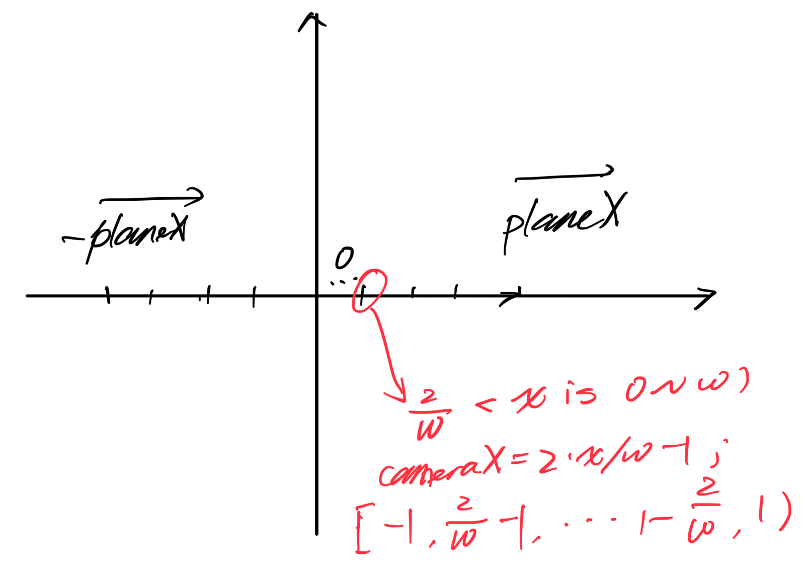
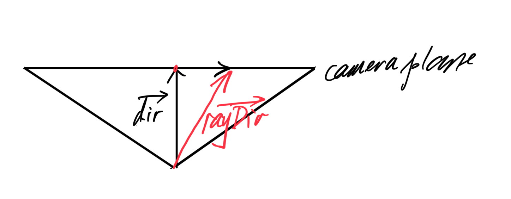
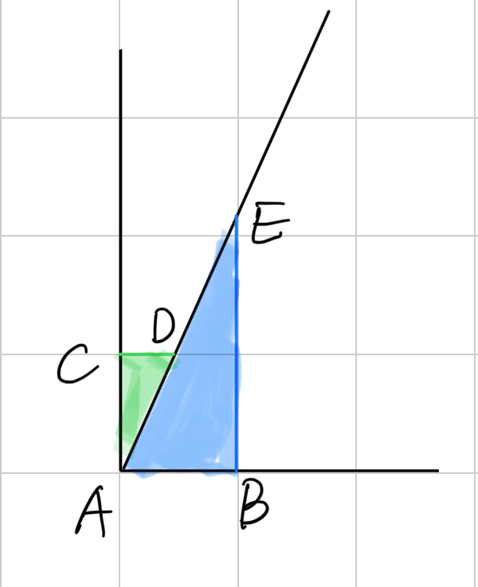
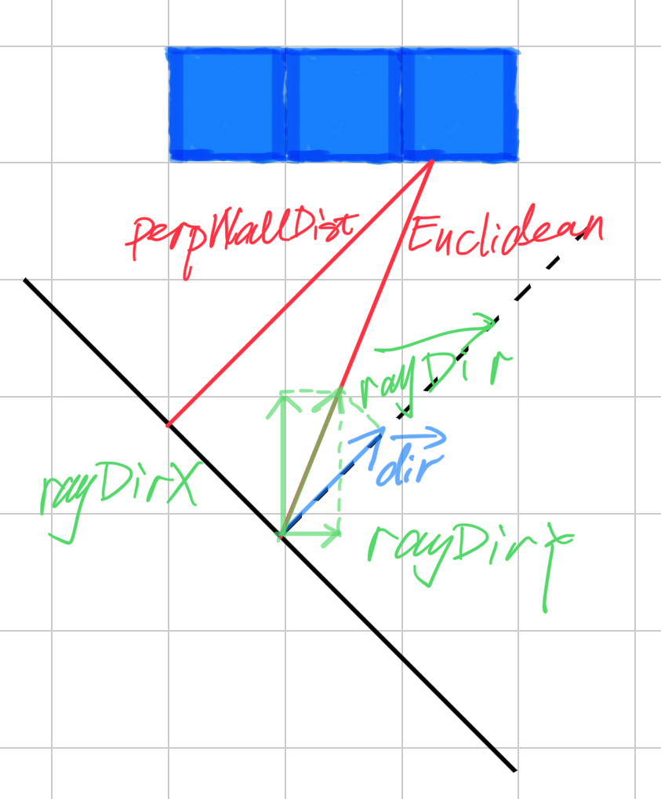
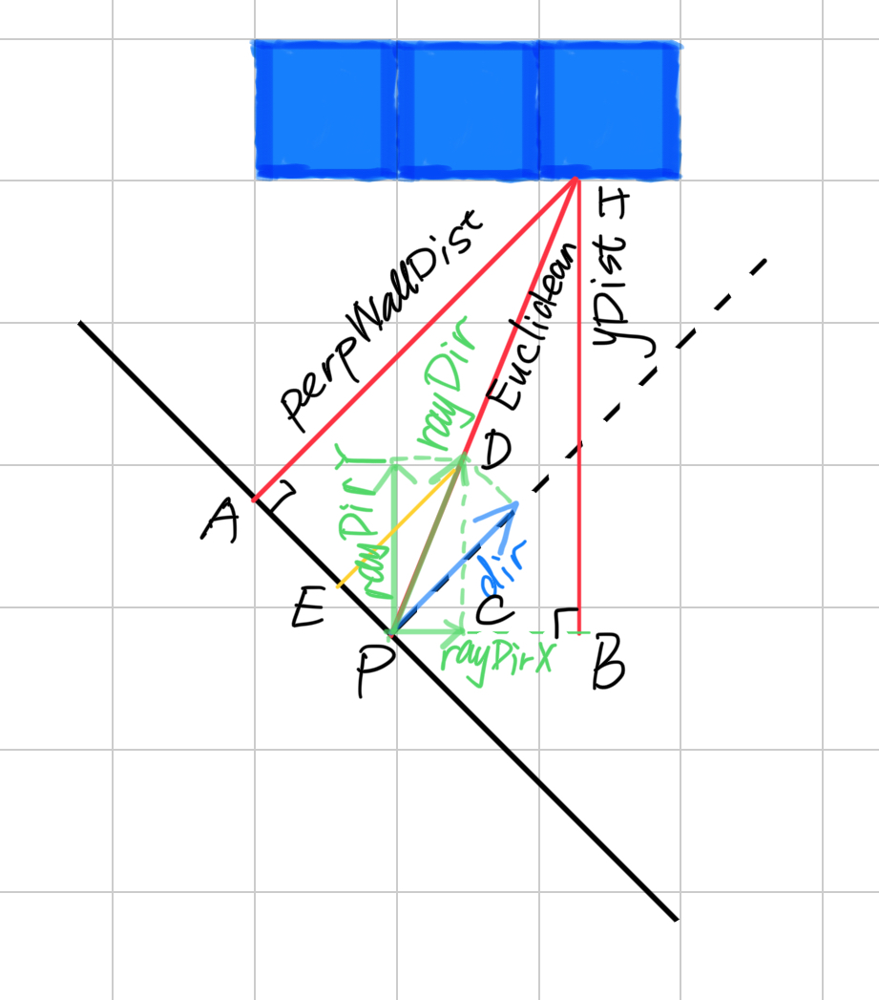
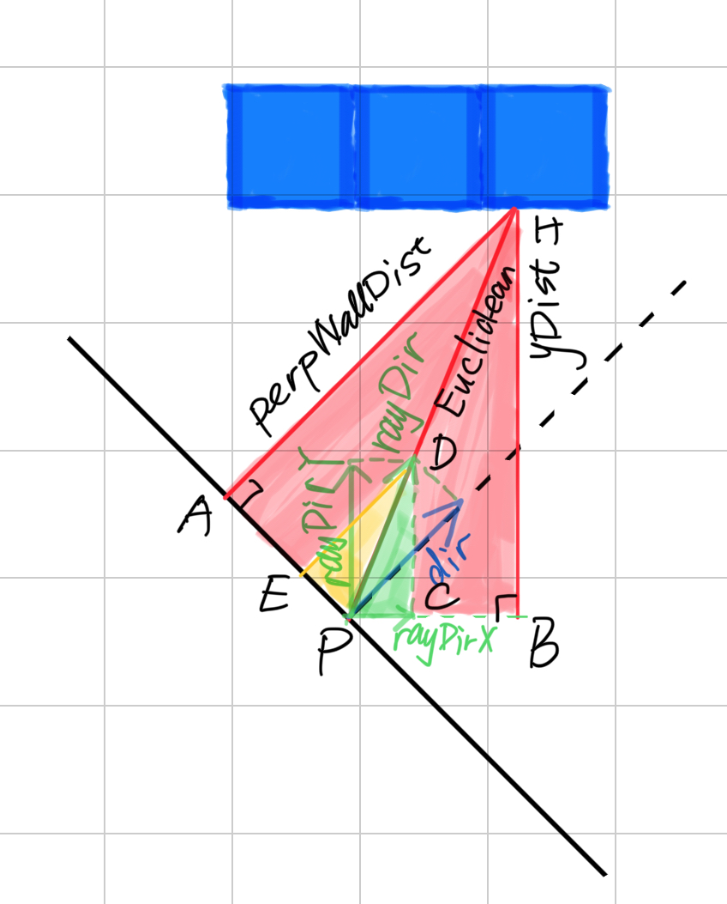

# Raycasting


### The Basic Idea

1. Send out a ray that starts at the player location and with a direction that depends on both the player's looking direction, and the coordinate of the screen.&#x20;
2. Then, let this ray move forward on the 2D map, until it hits a map square that is a wall.&#x20;
3. If it hit a wall, calculate the distance of this hit point to the player, and use this distance to calculate how high this wall has to be drawn on the scr hit blue walls:

<figure><figcaption></figcaption></figure>

## Algorithm

To find the first wall that a ray encounters on its way,&#x20;

1. Start at the player's position, and then all the time, check whether or not the ray is inside a wall.&#x20;
2. If it's inside a wall (hit), then the loop can stop, calculate the distance, and draw the wall with the correct height.&#x20;
3. If the ray position is not in a wall, trace it further:&#x20;
   * add a certain value to its position, in the direction of the direction of this ray,&#x20;
   * for this new position, again check if it's inside a wall or not.&#x20;
4. Keep doing this until finally a wall is hit.

the idea is to check at every side of a wall the ray will encounter. We give each square width 1, so each side of a wall is an integer value and the places in between have a value after the point. Now the step size isn't constant, it depends on the distance to the next side:

<figure><figcaption></figcaption></figure>

As you can see on the image above, the ray hits the wall exactly where we want it. In the way presented in this tutorial, an algorithm is used that's based on DDA or "Digital Differential Analysis".&#x20;

DDA is a fast algorithm typically used on square grids to find which squares a line hits (for example to draw a line on a screen, which is a grid of square pixels). So we can also use it to find which squares of the map our ray hits, and stop the algorithm once a square that is a wall is hit.

Some raytracers work with Euclidean angles to represent the direction of the player and the rays, and determinate the Field Of View with another angle.&#x20;

<figure><figcaption></figcaption></figure>

I found however that it's much easier to work with **vectors and a camera instead**:

* the position of the player is always a vector (an x and a y coordinate),&#x20;
* the direction is now determinated by two values: the x and y coordinate of the direction.&#x20;
* the camera plane vector. In a true 3D engine, there's also a camera plane, and there this plane is really a 3D plane so two vectors (u and v) are required to represent it. Raycasting happens in a 2D map however, so here the camera plane isn't really a plane, but a line, and is represented with a single vector.&#x20;

A direction vector can be seen as follows: if you draw a line in the direction the player looks, through the position of the player, then every point of the line is the sum of the position of the player, and a multiple of the direction vector.&#x20;

The camera plane should always be perpendicular on the direction vector. The camera plane represents the surface of the computer screen, while the direction vector is perpendicular on it and points inside the screen. The position of the player, which is a single point, is a point in front of the camera plane. A certain ray of a certain x-coordinate of the screen, is then the ray that starts at this player position, and goes through that position on the screen or thus the camera plane.

**The length of a direction vector doesn't really matter, only its direction. Multiplying x and y by the same value changes the length but keeps the same direction.**

<figure><figcaption></figcaption></figure>

The image above represents such a 2D camera.&#x20;

* The green spot is the position (**vector "pos"**).&#x20;
* The black line, ending in the black spot, represents the direction vector (**vector "dir"**), so the position of the black dot is pos+dir.&#x20;
* The blue line represents the full camera plane, the vector from the black dot to the right blue dot represents **the vector "plane"**, so the position of the right blue point is pos+dir+plane, and the posistion of the left blue dot is pos+dir-plane (these are all vector additions).
* The red lines in the image are a few rays. This ray direction is **the vector rayDir**, and the X and Y component of this vector are then used by the DDA algorithm. The direction of these rays is easily calculated out of the camera: it's the sum of the direction vector of the camear, and a part of the plane vector of the camera: for example the third red ray on the image, goes through the right part of the camera plane at the point about 1/3th of its length. So the direction of this ray is dir + plane\*1/3.&#x20;

The two outer lines, are the left and right border of the screen, and the angle between those two lines is called the **Field Of Vision or FOV**. The FOV is determinated by the ratio of the length of the direction vector, and the length of the plane. Here are a few examples of different FOV's:

<figure><figcaption></figcaption></figure>

<figure><figcaption></figcaption></figure>

<figure><figcaption></figcaption></figure>

If the direction vector and the camera plane vector have the same length, the FOV will be 90°:

If the direction vector is much longer than the camera plane, the FOV will be much smaller than 90°, and you'll have a very narrow vision. You'll see everything more detailed though and there will be less depth, so this is the same as zooming in:

If the direction vector is shorter than the camera plane, the FOV will be larger than 90° (180° is the maximum, if the direction vector is close to 0), and you'll have a much wider vision, like zooming out:

## Vector Rotate

<figure><figcaption></figcaption></figure>

<mark style="color:red;">When the player rotates, the camera has to rotate, so both the direction vector and the plane vector have to be rotated. Then, the rays will all automaticly rotate as well.</mark>

There's nothing that forbids you to use a camera plane that isn't perpendicular to the direction, but the result will look like a "skewed" world.

<figure><figcaption></figcaption></figure>

<figure><figcaption></figcaption></figure>

## Untextured Raycaster

Vector pos:&#x20;

```
private double posX;
private double posY;
```

Vector dir, is a unit vector, it's length is 1 :

```
private double dirX;
private double dirY;
```

Vector plane:

```
private double planeX;
private double planeY;
```

Vector rayDir:

```
double rayDirX = dirX + planeX * cameraX;
double rayDirY = dirY + planeY * cameraX;
```

```
//which box of the map we're in

```

length of ray from one x or y-side to next x or y-side

The ray starts at the position of the player (posX, posY).

```
for(int x = 0; x < w; x++)
    {
      //calculate ray position and direction
      double cameraX = 2 * x / double(w) - 1; //x-coordinate in camera space
      double rayDirX = dirX + planeX * cameraX;
      double rayDirY = dirY + planeY * cameraX;
```

**cameraX** is the x-coordinate on the camera plane that the current x-coordinate of the screen represents, done this way so that the right side of the screen will get coordinate 1, the center of the screen gets coordinate 0, and the left side of the screen gets coordinate -1.&#x20;

cameraX minimum gap difference is 2/w.

<figure><figcaption></figcaption></figure>

<figure><figcaption></figcaption></figure>

> _rayDir_ = _dir_ + _k_ \* _plane_

```
int mapX = (int)posX;
int mapY = (int)posY;
```

```
double deltaDistX = (rayDirX == 0) ? 1e30 : Math.abs(1 / rayDirX);
double deltaDistY = (rayDirY == 0) ? 1e30 : Math.abs(1 / rayDirY);
```

```
double sideDistX;
double sideDistY;
```

* mapX and mapY represent the current square of the map the ray is in. The ray position itself is a floating point number and contains both info about in which square of the map we are, and where in that square we are, but mapX and mapY are only the coordinates of that square.
* sideDistX and sideDistY are initially the distance the ray has to travel from its start position to the first x-side and the first y-side. Later in the code they will be incremented while steps are taken.
* deltaDistX and deltaDistY are the distance the ray has to travel to go from 1 x-side to the next x-side, or from 1 y-side to the next y-side. The following image shows the initial sideDistX, sideDistY and deltaDistX and deltaDistY:

<figure><figcaption></figcaption></figure>

For the blue triangle (deltaDistX), <mark style="color:red;">one side has length 1</mark> (as it is exactly one cell) and <mark style="color:red;">the other has length raydirY / raydirX because it is exaclty the amount of units the ray goes in the y-direction when taking 1 step in the X-direction (三角形相似).</mark> For the green triangle (deltaDistY), the formula is similar.

<figure><figcaption></figcaption></figure>


deltaDistX = sqrt(1 + (rayDirY \* rayDirY) / (rayDirX \* rayDirX))\
deltaDistY = sqrt(1 + (rayDirX \* rayDirX) / (rayDirY \* rayDirY))

But this can be simplified to:

deltaDistX = abs(|rayDir| / rayDirX)\
deltaDistY = abs(|rayDir| / rayDirY)

Where |rayDir| is the length of the vector rayDirX, rayDirY (that is sqrt(rayDirX \* rayDirX + rayDirY \* rayDirY)).

However, <mark style="color:red;">we can use 1 instead of |rayDir|, because only the</mark> <mark style="color:red;"></mark><mark style="color:red;">**ratio**</mark> <mark style="color:red;"></mark><mark style="color:red;">between deltaDistX and deltaDistY matters for the DDA code</mark> that follows later below, so we get:

deltaDistX = abs(1 / rayDirX)\
deltaDistY = abs(1 / rayDirY)

<mark style="color:red;">**Due to this, the deltaDist and sideDist values used in the code do not match the lengths shown in the picture above, but their relative sizes all still match.**</mark>

The variable **perpWallDist** will be used later to <mark style="color:red;">calculate the length of the ray.</mark>

**DDA Algorithm**

The DDA algorithm will always jump exactly one square each loop, either a square in the x-direction, or a square in the y-direction. If it has to go in the negative or positive x-direction, and the negative or positive y-direction will depend on the direction of the ray, and this fact will be stored in stepX and stepY. Those variables are always either -1 or +1.

Finally, hit is used to determinate whether or not the coming loop may be ended, and side will contain if an x-side or a y-side of a wall was hit. If an x-side was hit, side is set to 0, if an y-side was hit, side will be 1. By x-side and y-side, I mean the lines of the grid that are the borders between two squares.


Now, before the actual DDA can start, first **stepX, stepY**, and **the initial sideDistX and sideDistY** still have to be calculated.

**StepX & StepY**

* If the ray direction has a negative x-component, stepX is -1,&#x20;
* if the ray direciton has a positive x-component it's +1.&#x20;
* If the x-component is 0, it doesn't matter what value stepX has since it'll then be unused.\
  The same goes for the y-component.

**initial sideDistX and sideDistY**

* If the ray direction has a negative x-component, sideDistX is the distance from the ray starting position to the first side to the left,
* if the ray direciton has a positive x-component the first side to the right is used instead.
* The same goes for the y-component, but now with the first side above or below the position.
* For these values, the integer value mapX is used and the real position subtracted from it, and 1.0 is added in some of the cases depending if the side to the left or right, of the top or the bottom is used. Then you get the perpendicular distance to this side, so <mark style="color:red;">multiply it with deltaDistX or deltaDistY to get the real Euclidean distance</mark>.

**the actual DDA**&#x20;

It's a loop that increments the ray with 1 square every time, until a wall is hit.&#x20;

* Each time, either it jumps a square in the x-direction (with stepX) or a square in the y-direction (with stepY), it always jumps 1 square at once.&#x20;
* If the ray's direction would be the x-direction, the loop will only have to jump a square in the x-direction everytime, because the ray will never change its y-direction.&#x20;
* If the ray is a bit sloped to the y-direction, then every so many jumps in the x-direction, the ray will have to jump one square in the y-direction.&#x20;
* If the ray is exactly the y-direction, it never has to jump in the x-direction, etc...

sideDistX and sideDistY get incremented with deltaDistX with every jump in their direction, and mapX and mapY get incremented with stepX and stepY respectively.

When the ray has hit a wall, the loop ends, and then we'll know:

* whether an x-side or y-side of a wall was hit in the variable "side",&#x20;
* what wall was hit with mapX and mapY.

We won't know exactly where the wall was hit however, but that's not needed in this case because we won't use textured walls for now.

<mark style="color:red;">We don't use the Euclidean distance to the point representing player, but instead the distance to the camera plane (or, the distance of the point projected on the camera direction to the player), to avoid the fisheye effect</mark>. The fisheye effect is an effect you see if you use the real distance, where all the walls become rounded, and can make you sick if you rotate.

<figure><figcaption></figcaption></figure>

The image shows why we take distance to camera plane instead of player. With P the player, and the black line the camera plane: To the left of the player, a few red rays are shown from hitpoints on the wall to the player, representing Euclidean distance. On the right side of the player, a few green rays are shown going from hitpoints on the wall directly to the camera plane instead of to the player. So the lengths of those green lines are examples of the perpendicular distance we'll use instead of direct Euclidean distance.

In the image, the player is looking directly at the wall, and in that case you would expect the wall's bottom and top to form a perfectly horizontal line on the screen. However, the red rays all have a different lenght, so would compute different wall heights for different vertical stripes, hence the rounded effect. The green rays on the right all have the same length, so will give the correct result. The same still apllies for when the player rotates (then the camera plane is no longer horizontal and the green lines will have different lengths, but still with a constant change between each) and the walls become diagonal but straight lines on the screen. This explanation is somewhat handwavy but gives the idea.

Note that this part of the code isn't "fisheye correction", such a correction isn't needed for the way of raycasting used here, **the fisheye effect is simply avoided by the way the distance is calculated here.** It's even easier to calculate this perpendicular distance than the real distance, we don't even need to know the exact location where the wall was hit.

<mark style="color:red;">This perpenducular distance is called "perpWallDist"</mark> in the code.&#x20;

* One way to compute it is to use the formula for shortest distance from a point to a line, where the point is where the wall was hit, and the line is the camera plane:
* A more detailed derivation of the perpWallDist formula is depicted in the image below, for the side == 1 case.

<figure><figcaption></figcaption></figure>

However, it can be computed simpler than that: <mark style="color:red;">**due to how deltaDist and sideDist were scaled by a factor of |rayDir| above, the length of sideDist already almost equals perpWallDist**</mark>. <mark style="color:red;">We just need to subtract deltaDist once from it, going one step back, because in the DDA steps above we went one step further to end up inside the wall.</mark>

Depending on whether the ray hit an X side or Y side, the formula is computed using sideDistX, or sideDistY.


```
//Calculate distance projected on camera direction (Euclidean distance would give fisheye effect!)
      if(side == 0) perpWallDist = (sideDistX - deltaDistX);
      else          perpWallDist = (sideDistY - deltaDistY);
```


**Detailed Derivation of the perpWallDist Formula**

<figure><figcaption></figcaption></figure>


A more detailed derivation of the perpWallDist formula is depicted in the image below, for the side == 1 case.

Meaning of the points:

* P: position of the player, (posX, posY) in the code
* H: hitpoint of the ray on the wall. Its y-position is known to be mapY + (1 - stepY) / 2
* yDist matches "(mapY + (1 - stepY) / 2 - posY)", this is the y coordinate of the Euclidean distance vector, in world coordinates. Here, (1 - stepY) / 2) is a correction term that is 0 or 1 based on positive or negative y direction, which is also used in the initialization of sideDistY.
* dir: the main player looking direction, given by dirX,dirY in the code. The length of this vector is always exactly 1. This matches the looking direction in the center of the screen, as opposed to the direction of the current ray. It is perpendicular to the camera plane, and perpWallDist is parallel to this.
* orange dotted line (may be hard to see, use CTRL+scrollwheel or CTRL+plus to zoom in a desktop browser to see it better): the value that was added to dir to get rayDir. Importantly, this is parallel to the camera plane, perpendicular to dir.
* A: point of the camera plane closest to H, the point where perpWallDist intersects with camera plane
* B: point of X-axis through player closest to H, point where yDist crosses the world X-axis through the player
* C: point at player position + rayDirX
* D: point at player position + rayDir.
* E: This is point D with the dir vector subtracted, in other words, E + dir = D.
* points A, B, C, D, E, H and P are used in the explanation below: they form triangles which are considered: BHP, CDP, AHP and DEP.

The actual derivation:

<figure><figcaption></figcaption></figure>

1. 1: Triangles PBH and PCD have the same shape: &#x20;
   * yDist / rayDirY  = Euclidean / |rayDir|
   * perpWallDist = Euclidean / |rayDir| instead.
2. Triangles AHP and EDP have the same shape, and ED = |dir|, which is 1, |DP| = |rayDir|:&#x20;
   * Euclidean / |rayDir| = perpWallDist / |dir| = perpWallDist / 1.
3. Combining 1 and 2:&#x20;
   * perpWallDist = yDist / rayDirY, _<mark style="color:yellow;">where yDist is (mapY + (1 - stepY) / 2) - posY</mark>_
4. In the code:
   * **Euclidean = sideDistY - deltaDistY**, after the DDA steps, <mark style="color:yellow;">equals (posY + (1 - stepY) / 2 - mapY) \* deltaDistY (given that sideDistY is computed from posY and mapY)</mark>
   * **deltaDistY = |rayDir| / |rayDirY| **<mark style="color:red;">**(|rayDir| is 1 in the code, and beacause this could be counteracted and use 1 will simply the calculation. and during the analysis, will still use the actural value)**</mark>
5. yDist = Euclidean / deltaDistY, and Based on 4:  yDist =  (sideDistY - deltaDistY) / deltaDistY, which is **yDist  =  (sideDistY - deltaDistY) \* |rayDirY| / |rayDir|** .
6. Combining 5 and 3 gives perpWallDist = yDist / rayDirY = (sideDistY - deltaDistY) \* |rayDirY| / rayDirY, which is : **perpWallDist = (sideDistY - deltaDistY) / |rayDir|** .
7. When <mark style="color:red;">calculating lines in the following text, the actual perpWallDist not important</mark>, and then:
   * In 4, deltaDistY could be simplified as: **deltaDistY = 1 / |rayDirY|**
   * then the result would be: **perpWallDist = (sideDistY - deltaDistY)**

Now that we have the calculated distance (perpWallDist), we can calculate the height of the line that has to be drawn on screen: this is the inverse of perpWallDist, and then multiplied by h, the height in pixels of the screen, to bring it to pixel coordinates. You can of course also multiply it with another value, for example 2\*h, if you want to walls to be higher or lower. The value of h will make the walls look like cubes with equal height, width and depth, while large values will create higher boxes (depending on your monitor).

Then out of this lineHeight (which is thus the height of the vertical line that should be drawn), the start and end position of where we should really draw are calculated. The center of the wall should be at the center of the screen, and if these points lie outside the screen, they're capped to 0 or h-1.

```
  //Calculate height of line to draw on screen
  int lineHeight = (int)(h / perpWallDist);

  //calculate lowest and highest pixel to fill in current stripe
  int drawStart = -lineHeight / 2 + h / 2;
  if(drawStart < 0)drawStart = 0;
  int drawEnd = lineHeight / 2 + h / 2;
  if(drawEnd >= h)drawEnd = h - 1;
```

Finally, depending on what number the wall that was hit has, a color is chosen. If an y-side was hit, the color is made darker, this gives a nicer effect. And then the vertical line is drawn with the verLine command. This ends the raycasting loop, after it has done this for every x at least.

```
//choose wall color
      ColorRGB color;
      switch(worldMap[mapX][mapY])
      {
        case 1:  color = RGB_Red;  break; //red
        case 2:  color = RGB_Green;  break; //green
        case 3:  color = RGB_Blue;   break; //blue
        case 4:  color = RGB_White;  break; //white
        default: color = RGB_Yellow; break; //yellow
      }

      //give x and y sides different brightness
      if (side == 1) {color = color / 2;}

      //draw the pixels of the stripe as a vertical line
      verLine(x, drawStart, drawEnd, color);
    }
```
